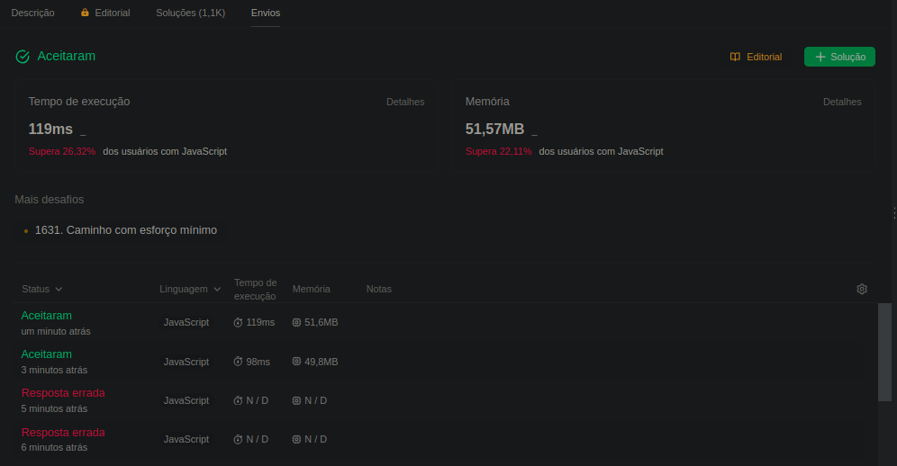
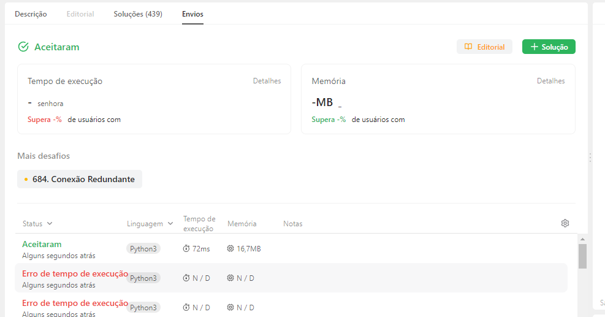
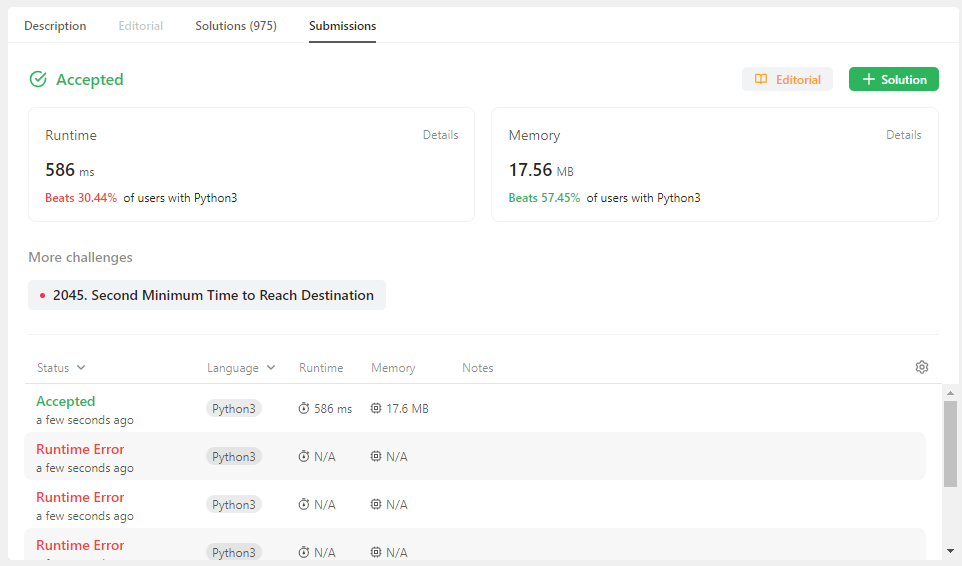

# Grafos 2 - Exercícios

**Número da Lista**: 2
**Conteúdo da Disciplina**: Grafos 2
**Dupla:** 5

## Alunos
|Matrícula | Aluno |
| -- | -- |
| 20/2016767  |  Lucas Felipe Soares |
| 19/0033681 | Luiz Henrique Fernandes Zamprogno |

## Sobre 
A aplicação dos conceitos de Grafos 2 aprendidos na disciplina de Projeto de Algoritmos da disciplina foi realizada por meio da realização de X exercícios sobre o assunto de grafos. Exercícios Executados:

### Exércicios executados

| Exercício | Dificuldade | Id Leetcode | Linguagem | Código |
| -- | -- | -- | -- | -- |
[2203 - Subgráfico Mínimo Ponderado com os Caminhos Necessários](https://github.com/projeto-de-algoritmos/Grafos2_ExerciciosResolvidos/blob/master/2203subgrafoMinimo.pdf)|Díficil|[2203](https://leetcode.com/problems/minimum-weighted-subgraph-with-the-required-paths/)|JavaScript|[Resolução](https://github.com/projeto-de-algoritmos/Grafos2_ExerciciosResolvidos/blob/master/2203subgrafoMinimo.js)|
|[778 - Nade em águas crescentes](https://github.com/projeto-de-algoritmos/Grafos2_ExerciciosResolvidos/blob/master/778nadeAguasProfundas.pdf)|Díficil|[778](https://leetcode.com/problems/swim-in-rising-water/description/)|JavaScript|[Resolução](https://github.com/projeto-de-algoritmos/Grafos2_ExerciciosResolvidos/blob/master/778nadeAguasProfundas.js)|
|[1489 - Encontre arestas críticas e pseudocríticas na árvore de abrangência mínima](https://github.com/projeto-de-algoritmos/Grafos2_ExerciciosResolvidos/blob/master/arestasCriticas.pdf)|Díficil|[1489](https://leetcode.com/problems/find-critical-and-pseudo-critical-edges-in-minimum-spanning-tree/description/)|JavaScript|[Resolução](https://github.com/projeto-de-algoritmos/Grafos2_ExerciciosResolvidos/blob/master/1489arestasCriticas.js)|
|[685 - Conexão Redundante II](https://github.com/projeto-de-algoritmos/Grafos2_ExerciciosResolvidos/blob/master/685ConexaoRedundanteII.pdf)|Díficil|[685](https://leetcode.com/problems/redundant-connection-ii/description/)|Python3|[Resolução](https://github.com/projeto-de-algoritmos/Grafos2_ExerciciosResolvidos/blob/master/685ConexaoRedundanteII.py)|
|[1334 - Encontre a cidade com o menor número de vizinhos a uma distância limite](https://github.com/projeto-de-algoritmos/Grafos2_ExerciciosResolvidos/blob/master/1334NumeroVizinhosdistanciaLimite.pdf)|Díficil|[1334](https://leetcode.com/problems/find-the-city-with-the-smallest-number-of-neighbors-at-a-threshold-distance/description/)|Python3|[Resolução](https://github.com/projeto-de-algoritmos/Grafos2_ExerciciosResolvidos/blob/master/1334NumeroVizinhosdistanciaLimite.py)|
|[743 - Tempo de atraso da rede](https://github.com/projeto-de-algoritmos/Grafos2_ExerciciosResolvidos/blob/master/743TempoAtrasoRede.pdf)|Díficil|[1334](https://leetcode.com/problems/network-delay-time/description/)|Python3|[Resolução](https://github.com/projeto-de-algoritmos/Grafos2_ExerciciosResolvidos/blob/master/743TempoAtrasoRede.py)|

## Video

YouTube: [video](https://youtu.be/uQTGUCsqMXw) 
Arquivo: [video](https://github.com/projeto-de-algoritmos/Grafos2_ExerciciosResolvidos/blob/master/video.mp4)

## Screenshots

### 2203 - SubGrafo Mínimo Ponderado com os caminhos necessários

### 778 - Nade em águas crescentes

### 1489 - Encontre arestas críticas e pseudocríticas na árvore de abrangência mínima

### 685 Conexão Redundante II

### 1334 - Encontre a cidade com o menor número de vizinhos a uma distância limite

### 743 - Tempo de atraso da rede

## Instalação 

Não é necessario instalação, os exercicios devem ser rodados no site [leetcode]([link](https://leetcode.com/problemset/all/)).

**Linguagem 1**: Python3 
**Linguagem 2**: Javascript 

## Uso 

1. Acesse o site [LeetCode](https://leetcode.com/problemset/all/).

2. Crie uma conta e faça o login.

3. Vá para o link do exercício desejado, que pode ser encontrado na coluna "Id LeetCode" da tabela de exercícios executados.

4. Selecione a linguagem de programação correspondente ao exercício, indicada na coluna "Linguagem" da tabela de exercícios executados.

5. Copie o código correspondente encontrado na coluna "Código" da tabela de exercícios executados.

6. Clique no botão "Enviar" no canto inferior direito e verifique a execução correta do código.

## Outros 
Quaisquer outras informações sobre seu projeto podem ser descritas abaixo.

